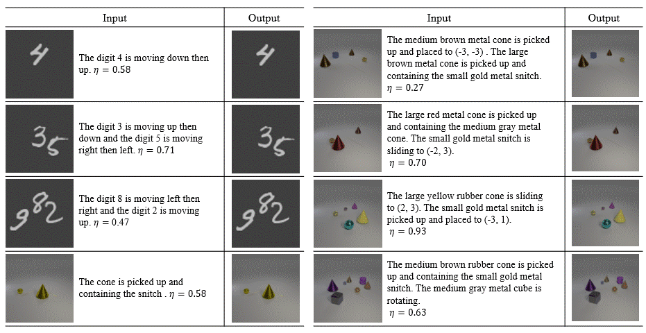
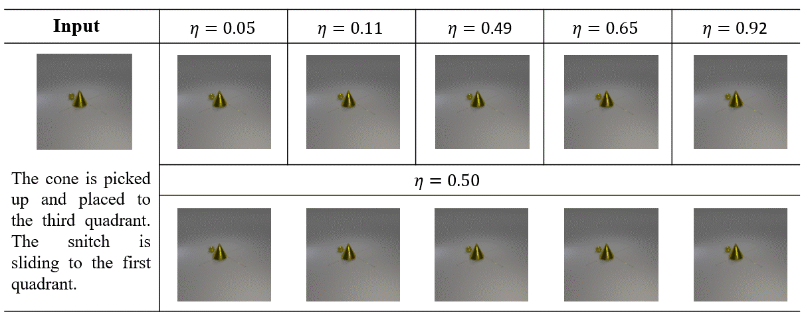
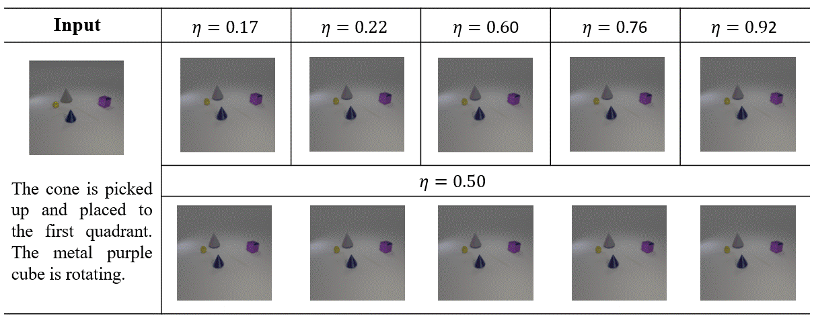
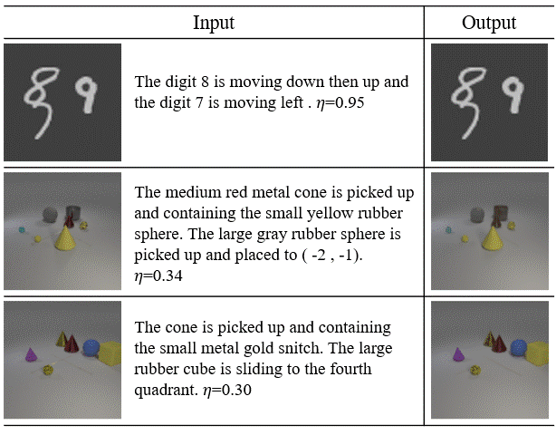

# Make It Move: Controllable Image-to-Video Generation with Text Descriptions


This repository contains datasets and some generated examples from MAGE used in the CVPR'2022 paper ``Make It Move: Controllable Image-to-Video Generation with Text Descriptions". [[arxiv](https://arxiv.org/abs/2112.02815)]

## Dataset Generation
### Moving MNIST datasets
The scripts to generate Moving MNIST datasets are modified based on [Sync-DRAW](https://github.com/syncdraw/Sync-DRAW). You can run the following commands to generate Single Moving MNIST, Double Moving MNIST and our Modified Double Moving MNIST, respectively. 
```bash
$ python data/mnist_caption_single.py
$ python data/mnist_caption_double.py
$ python data/mnist_caption_double_modified.py
```
### CATER-GENs
#### Datasets Download
The original CATER-GEN-v1 and CATER-GEN-v2 used in our paper are provided at [link1](https://drive.google.com/drive/folders/1ICIP5qY1rTod-hTLz5zJSxlbrHrGrdt4?usp=sharing) and [link2](https://drive.google.com/drive/folders/1xJM7gNDCslpM8MJNYT1fqgiG8yyIl6ue?usp=sharing), respectively.
#### Create Your Own Datasets
Thanks to authors of [CATER](https://github.com/rohitgirdhar/CATER) and [CLEVR](https://github.com/facebookresearch/clevr-dataset-gen) for making their code available, you can also generate your own datasets as following.

First, please generate videos and metadata according to the guideline of [CATER](https://github.com/rohitgirdhar/CATER). Please change the hyper-parameters including `min_objects, max_objects, num_frames, num_images, width, height`, and fix `CAM_MOTION = False, start_frame = 0`.
Then, you can generate text descriptions by running:
```bash
$ python data/gen_cater_text_anno.py
```

## Generated Samples of MAGE
### Deterministic Generation


### Diverse Generation



### Failure Cases


## Citation
```
@InProceedings{hu2022mage,
    title={Make It Move: Controllable Image-to-Video Generation with Text Descriptions},
    author={Yaosi Hu and Chong Luo and Zhenzhong Chen},
    booktitle={Proceedings of the IEEE/CVF Conference on Computer Vision and Pattern Recognition (CVPR)},
    year={2022}
}
```
